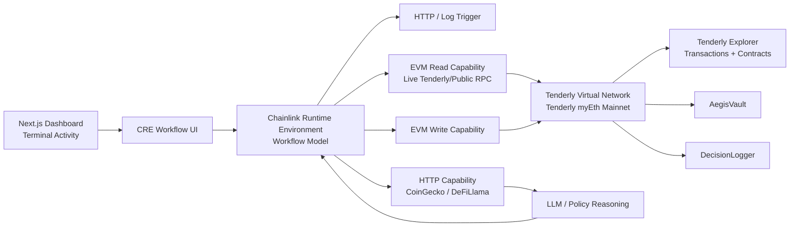
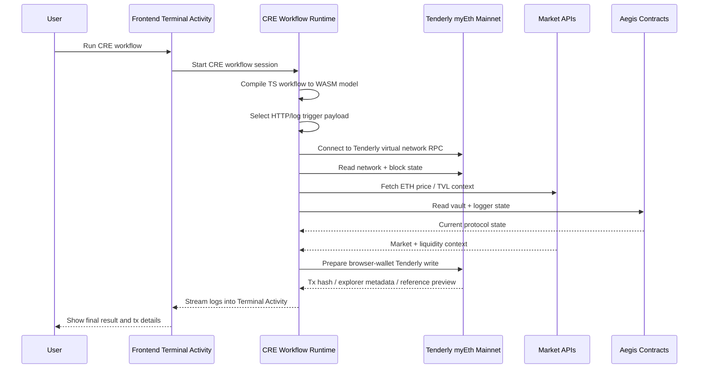

# 🛡️ Aegis Protocol

**AI-powered DeFi guardian with a Chainlink Runtime Environment (CRE) workflow, browser-wallet execution, and Tenderly Virtual Network deployment**

Aegis Protocol is an autonomous protection stack for Ethereum that watches DeFi positions, scores market risk, reasons over threats with LLMs, cross-checks prices against Uniswap liquidity, and records decision evidence on-chain. Aegis Protocol includes CRE + Tenderly surfaces in `agent/src/cre/*`, and a **frontend browser-wallet execution path** that performs live Tenderly/public RPC reads and submits a real `DecisionLogger.logDecision(...)` transaction on the active **Tenderly myEth Mainnet** virtual network.

## Project Features

Aegis Protocol has two main operational modes:

### 1. Native Guardian Loop 

A six-phase autonomous protection cycle:

```text
OBSERVE → ANALYZE → AI REASON → DEX VERIFY → DECIDE → EXECUTE
```

#### Features

- **24/7 Monitoring** — reads live market data from CoinGecko API, DeFiLlama API, and Ethereum RPC
- **Heuristic Risk Scoring** — analyzes price volatility, liquidity health, volume anomalies, holder concentration, and momentum risk
- **LLM AI Reasoning** — uses Groq (Llama 3.3 70B) or OpenAI (GPT-4o) or Gemini for structured threat analysis with deterministic fallback
- **DEX Verification** — cross-checks API pricing against Uniswap V2 reserve data to reduce oracle manipulation risk
- **Autonomous Decision Making** — classifies threat levels and action confidence
- **On-Chain Execution** — logs decisions via `DecisionLogger` and triggers user-approved protection flows through `AegisVault`

#### Smart Contracts

- **AegisRegistry** — ERC-721 agent identity, tiers, and reputation
- **AegisVault** — non-custodial ETH / ERC-20 protection vault with emergency exits
- **DecisionLogger** — immutable audit trail for risk snapshots and AI decisions

### 2. CRE + Tenderly Workflow (Current Implementation) ⭐

Aegis Protocol implements CRE and Tenderly in **two connected but distinct paths**:

- **Frontend live path** — the dashboard runs the 6-phase CRE flow, connects the browser wallet, auto-switches/adds the Tenderly network in MetaMask, and submits a **real Tenderly transaction** to `DecisionLogger`
- **Agent/CLI transcript path** — `npm run cre:live` runs the bootcamp-style CRE workflow transcript, performs live reads, and prints an explorer-ready **reference tx hash** for the workflow

Both paths share the same target network and contract addresses:

```text
COMPILE → TRIGGER → NETWORK → READ → ORCHESTRATE → WRITE
```

Aegis Protocol implements CRE and Tenderly through the frontend transcript UI, the browser-wallet contract writer, the `agent/src/cre/index.ts` workflow runner, and the bootcamp-style `agent/cre/project.yaml` structure.

#### CRE-specific features

##### Agent / CLI CRE transcript

- TypeScript workflow compiled to WASM / QuickJS-compatible runtime semantics
- Project metadata loaded from `agent/cre/project.yaml`
- Registered capabilities: HTTP trigger, EVM read, HTTP fetch, EVM write
- Live runtime snapshot loader in `agent/src/cre/runtime.ts`
- Deterministic workflow transcript builder in `agent/src/cre/workflow.ts`

##### Frontend live CRE execution

- `frontend/src/components/AgentSimulation.tsx` renders the 6 phases and terminal activity
- `frontend/src/lib/useWallet.ts` handles `wallet_switchEthereumChain` and `wallet_addEthereumChain`
- `frontend/src/lib/useContracts.ts` performs `staticCall`, `estimateGas`, raw `eth_sendTransaction`, and receipt waiting
- Successful writes return the tx hash, receipt metadata, and Tenderly explorer URL in the UI

##### Tenderly Virtual Network integration

- Targets `Tenderly myEth Mainnet` for isolated live testing
- Live RPC-backed reads via Tenderly/public RPC using `TENDERLY_VIRTUAL_TESTNET_RPC`
- Reads real network state, block data, vault state, and logger history when configured contract addresses are available

##### CRE orchestration

- Fetches market data via HTTP capability from CoinGecko and DeFiLlama
- Performs EVM reads on Tenderly-backed contract surfaces
- Applies risk policy and LLM-style reasoning flow
- Produces deterministic protection decisions

##### Tenderly write behavior

- **Frontend:** sends a real transaction on the active Tenderly Virtual Network via the connected browser wallet
- **CLI transcript:** prints a deterministic reference tx hash for the workflow transcript and explorer preview
- Neither path writes to Ethereum mainnet; both target the configured Tenderly Virtual Network

##### Frontend Terminal Activity

- Live workflow transcript streamed to the Terminal Activity panel
- Shows all 6 phases with timestamped logs
- Displays Tenderly explorer links for real frontend txs and CLI reference tx previews
- Includes env-driven deployed contract tables with explorer surfaces

#### Why CRE + Tenderly together?

- **CRE** provides workflow orchestration, triggers, capability composition, and deterministic execution
- **Tenderly** provides an isolated virtual network with explorer, RPC access, and transaction visibility
- Together they enable mainnet-like testing without modifying Ethereum mainnet state

#### Run the CRE workflow

Run `npm run cre:live` for the CLI transcript, or open the frontend and click **Run CRE Workflow** for the browser-wallet Tenderly write path.

This executes `agent/src/cre/index.ts` and performs live runtime reads when Tenderly/public RPC environment variables are configured. `npm run simulate:cre` is kept as a compatibility alias.

## Key Differentiators

- Autonomous action instead of alert-only monitoring
- Dual intelligence: heuristics plus LLM reasoning
- On-chain reserve verification instead of trusting API data blindly
- CRE-style workflow orchestration with live read validation before deployment
- Tenderly virtual-network validation with isolated-state live testing
- Non-custodial design with user-controlled emergency exits
- Transparent decisions with on-chain attestations

## Architecture diagram



## Data flow diagram



## Core components

| Component | Role |
|---|---|
| `AegisRegistry` | ERC-721 identity and reputation for agents |
| `AegisVault` | Non-custodial ETH / ERC-20 protection vault |
| `DecisionLogger` | Immutable audit trail for risk snapshots and AI decisions |
| `agent/` | Monitoring, analysis, AI reasoning, execution, and bootcamp-style CRE workflow CLI |
| `frontend/` | Next.js dashboard with native guardian mode, CRE workflow terminal activity, and env-driven explorer surfaces |

## Tenderly live-test configuration

- **Network:** Tenderly myEth Mainnet
- **Chain ID:** `9991`
- **Primary RPC:** `TENDERLY_VIRTUAL_TESTNET_RPC` / `NEXT_PUBLIC_TENDERLY_PUBLIC_RPC`
- **Target environment:** Tenderly Virtual Network (`tenderly-myeth-mainnet`)
- **Explorer:** env-driven chain explorer plus Tenderly Explorer for live-test transaction traces
- **DEX verification:** Uniswap V2

## Current CRE + Tenderly implementation status

### Active Tenderly environment

| Item | Value |
|---|---|
| Network | `Tenderly myEth Mainnet` |
| Chain ID | `9991` |
| RPC | `https://virtual.mainnet.eu.rpc.tenderly.co/1a852ec7-470b-4719-83e5-7e4d741e729d` |
| Explorer base | `https://dashboard.tenderly.co/explorer/vnet/1a852ec7-470b-4719-83e5-7e4d741e729d` |
| Current deployment record | `deployment.json` |

### Deployed contracts on the active VNet

| Contract | Address |
|---|---|---|
| `AegisRegistry` | `0x4Cd7fDFf83DC1540696BdaF38840a93134336dF8` | 
| `AegisVault` | `0xB433a6F3c690D17E78aa3dD87eC01cdc304278a9` | 
| `DecisionLogger` | `0x95ee06ec2D944B891E82CEd2F1404FBB8A36dA44` | 

### Transaction references

| Purpose | Tx ID | Explorer | Notes |
|---|---|---|---|
| Real Tenderly browser-wallet write | `0x163f5f0a4469e3dec12251041b464f239dd05db1f115ac3bb1897f92c5d2c631` | https://dashboard.tenderly.co/explorer/vnet/1a852ec7-470b-4719-83e5-7e4d741e729d/tx/0x163f5f0a4469e3dec12251041b464f239dd05db1f115ac3bb1897f92c5d2c631 | Verified successful `DecisionLogger.logDecision(...)` write on the active VNet |
| CLI workflow reference tx | `0xbc572b1cf1f0e28590568bc21d0bdfb6926146e8482f68a25e63a23923291aa4` | https://dashboard.tenderly.co/explorer/vnet/1a852ec7-470b-4719-83e5-7e4d741e729d/tx/0xbc572b1cf1f0e28590568bc21d0bdfb6926146e8482f68a25e63a23923291aa4 | Deterministic explorer-ready reference emitted by the CRE transcript path |

### Where CRE and Tenderly are implemented

| Path | Responsibility |
|---|---|
| `agent/cre/project.yaml` | Bootcamp-style CRE project metadata |
| `agent/src/cre/index.ts` | `npm run cre:live` entrypoint |
| `agent/src/cre/config.ts` | CRE/Tenderly env loading, workflow labels, explorer base, reference tx generation |
| `agent/src/cre/runtime.ts` | Live Tenderly/public RPC state snapshot loader |
| `agent/src/cre/workflow.ts` | 6-step CRE transcript builder and explorer preview output |
| `agent/src/cre/transcript.ts` | Terminal transcript printer |
| `frontend/src/components/AgentSimulation.tsx` | Frontend CRE phases, activity log, and tx result rendering |
| `frontend/src/lib/useWallet.ts` | MetaMask connect + Tenderly network switch/add flow |
| `frontend/src/lib/useContracts.ts` | Browser-wallet `DecisionLogger` write path, preflight checks, raw `eth_sendTransaction`, receipt wait |
| `frontend/src/lib/constants.ts` | Active chain config, explorer helpers, and deployed contract addresses |
| `hardhat.config.ts` | Hardhat `tenderlyVnet` network configuration |
| `scripts/deploy.ts` | Deployment, authorization, and `deployment.json` generation |
| `contracts/DecisionLogger.sol` | On-chain CRE decision logging target |
| `deployment.json` | Current active VNet deployment addresses used by the docs/config |

## Quick start

### Install

```bash
npm ci --legacy-peer-deps
cd agent && npm ci
cd ../frontend && npm ci
cd ..
```

### Compile and test

```bash
npm run compile
npx hardhat test
```

### Run the agent

```bash
cd agent
npx ts-node src/index.ts
```

### Run the frontend

```bash
cd frontend
npm run dev
```

### Run the CRE + Tenderly workflow transcript

```bash
npm run cre:live
```

This runs the refactored CRE entrypoint at `agent/src/cre/index.ts` and performs live runtime reads when your Tenderly/public RPC environment variables are configured.

### Deploy to Ethereum Mainnet

```bash
cp .env.example .env
# set PRIVATE_KEY and optionally ETH_MAINNET_RPC / ETHERSCAN_API_KEY
npm run deploy:mainnet
```

## Frontend CRE terminal activity

Open the dashboard and scroll to the **Live Agent & CRE Workflow** section.

- choose **Guardian** to view the native six-phase Aegis loop
- choose **CRE + Tenderly Live** to view the CRE workflow transcript and live Tenderly write path
- the `READ` phase performs a real runtime snapshot against the configured Tenderly/public RPC
- the `WRITE` phase requests browser-wallet approval and returns the Tenderly tx hash on success
- the right-hand **Terminal Activity** panel shows timestamped workflow logs
- the left terminal window shows the active phase output and final summary


## Explorer and deployed-contract surfaces

The frontend renders an **env-driven deployed contract table** and explorer links from `frontend/src/lib/constants.ts`. The helper layer normalizes Tenderly explorer URLs before constructing `/address/<address>` and `/tx/<hash>` links.

### Frontend explorer metadata

| Variable | Purpose |
|---|---|
| `NEXT_PUBLIC_CHAIN_NAME` | chain label shown in the dashboard footer and contract surfaces |
| `NEXT_PUBLIC_CHAIN_EXPLORER_NAME` | deployed-contract explorer label shown in the UI |
| `NEXT_PUBLIC_CHAIN_EXPLORER_URL` | base URL used for deployed contract address and code links |
| `NEXT_PUBLIC_TENDERLY_EXPLORER_NAME` | label used for the CRE runtime explorer |
| `NEXT_PUBLIC_TENDERLY_EXPLORER_URL` | Tenderly explorer base URL used for live-test CRE transaction links |

### Deployed contract env mapping

| Contract | Frontend env var | Source |
|---|---|---|
| `AegisRegistry` | `NEXT_PUBLIC_REGISTRY_ADDRESS` | `contracts/AegisRegistry.sol` |
| `AegisVault` | `NEXT_PUBLIC_VAULT_ADDRESS` | `contracts/AegisVault.sol` |
| `DecisionLogger` | `NEXT_PUBLIC_LOGGER_ADDRESS` | `contracts/DecisionLogger.sol` |


## Environment variables

Base variables:

- `PRIVATE_KEY`
- `ETH_MAINNET_RPC`
- `ETHERSCAN_API_KEY`
- `GROQ_API_KEY`
- `OPENAI_API_KEY`

Optional CRE / Tenderly live-test variables:

- `CRE_WORKFLOW_ID`
- `CRE_TARGET`
- `CRE_TRIGGER`
- `TENDERLY_VIRTUAL_TESTNET_NAME`
- `TENDERLY_VIRTUAL_TESTNET_RPC`
- `TENDERLY_VIRTUAL_TESTNET_EXPLORER`
- `REFERENCE_ADDRESS`
- `NEXT_PUBLIC_CHAIN_NAME`
- `NEXT_PUBLIC_CHAIN_ID`
- `NEXT_PUBLIC_CHAIN_EXPLORER_NAME`
- `NEXT_PUBLIC_CHAIN_EXPLORER_URL`
- `NEXT_PUBLIC_TENDERLY_EXPLORER_NAME`
- `NEXT_PUBLIC_CRE_WORKFLOW_ID`
- `NEXT_PUBLIC_CRE_TARGET`
- `NEXT_PUBLIC_CRE_TRIGGER`
- `NEXT_PUBLIC_TENDERLY_VIRTUAL_TESTNET_NAME`
- `NEXT_PUBLIC_TENDERLY_PUBLIC_RPC`
- `NEXT_PUBLIC_TENDERLY_EXPLORER_URL`
- `NEXT_PUBLIC_REFERENCE_ADDRESS`
- `TENDERLY_VIRTUAL_TESTNET_CHAIN_ID`

Use `.env.example` as the source of truth for the current Tenderly + frontend defaults.

## Source layout for the CRE + Tenderly implementation

```text
contracts/                     Solidity contracts and onchain surfaces
agent/cre/project.yaml         CRE project metadata in bootcamp-style layout
agent/cre/secrets.example.yaml Example secret bindings for CRE/Tenderly execution
agent/src/cre/index.ts         CRE workflow entrypoint
agent/src/cre/config.ts        CRE config/env loader
agent/src/cre/runtime.ts       Tenderly/public RPC runtime snapshot loader
agent/src/cre/workflow.ts      Workflow step builder
agent/src/cre/transcript.ts    Terminal transcript printer
agent/src/cre-simulate.ts      Compatibility shim for simulate:cre
frontend/src/components/AgentSimulation.tsx
frontend/src/lib/creSimulation.ts
frontend/src/lib/creRuntime.ts
frontend/src/lib/constants.ts
frontend/src/app/page.tsx
README.md                      Architecture, data flow, setup, and feature docs
```

## Explorer and transaction behavior

The CRE/Tenderly flow now maps directly to:

- **Tenderly explorer** for live-test transaction history and execution traces
- **Chainlink CRE workflow structure** for trigger-driven orchestration
- **env-driven deployed contract tables** for real address/explorer surfaces in the UI

The current implementation performs **real runtime reads** and supports a **real browser-wallet write** on the active Tenderly virtual network. The CLI transcript path still emits an explorer-ready **reference tx** for workflow previewing, while the frontend write path can produce an actual mined Tenderly transaction.

## Why Aegis is different

- **Autonomous protection** instead of alert-only monitoring
- **LLM reasoning with structured output** instead of template rules alone
- **On-chain reserve verification** instead of trusting API data blindly
- **CRE-style workflow orchestration** with live read validation before deployment
- **Tenderly virtual-network validation** with isolated-state execution
- **On-chain attestations** that link decisions to immutable hashes

## Repository guide

```text
contracts/   Solidity contracts
agent/       Monitoring, reasoning, verification, execution
frontend/    Next.js dashboard
scripts/     Deployment and demo scripts
test/        Hardhat tests
```

## License

Aegis Protocol is licensed under the MIT License.

## Thanks

Special thanks to the Chainlink and Tenderly team for their support and assistance with this project.


